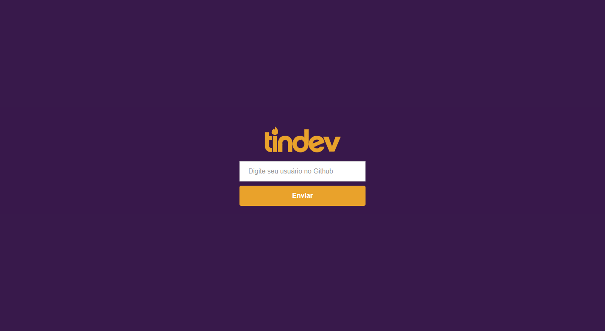
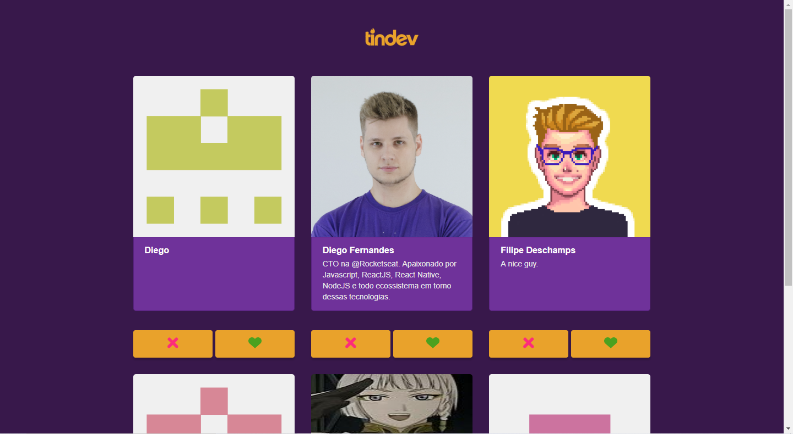
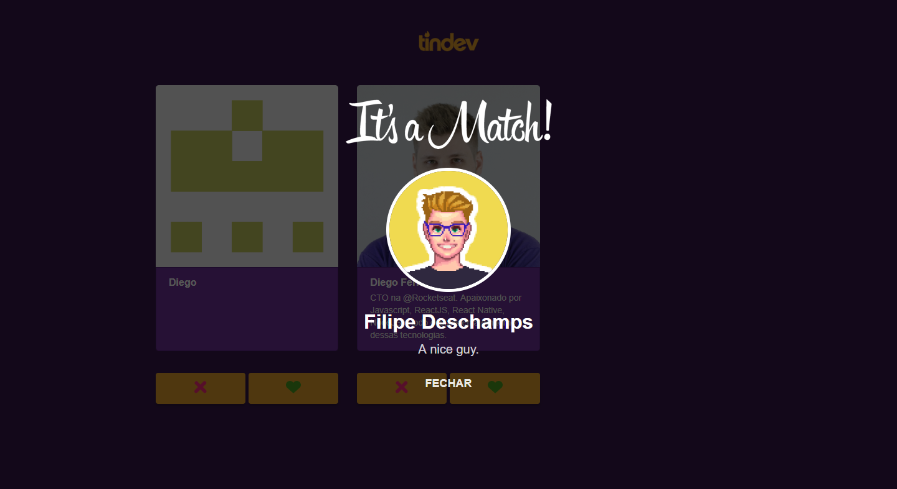
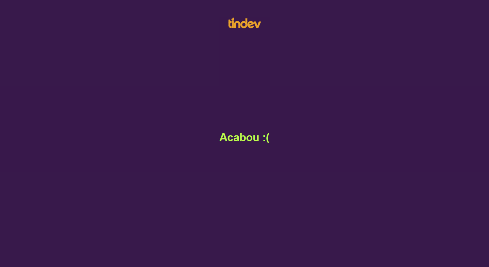
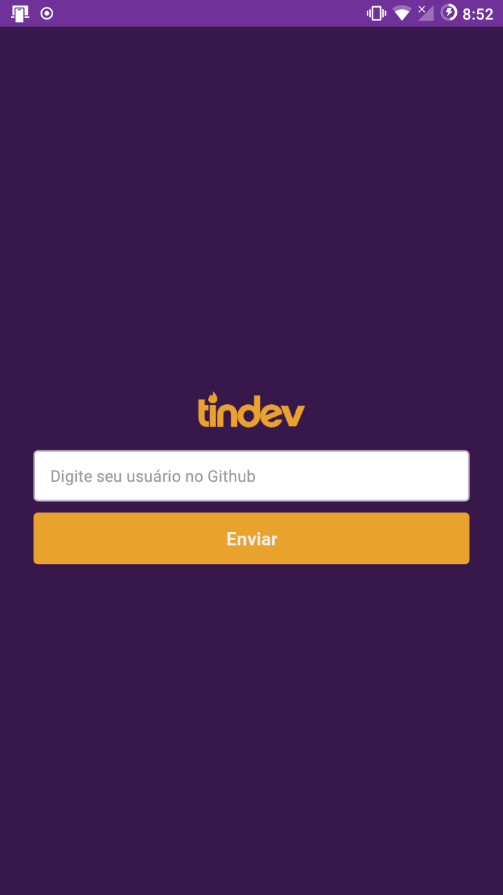
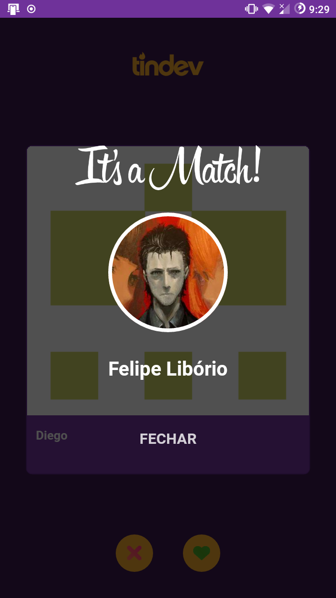

# Tindev
Tinder like SNS made with Node.js as backend, React as frontend and React Native for mobile. It follows Rocketseat's "Semana Omnistack 8.0".

## Web interface

## Mobile interface
 

 

## Running

### Backend
With a terminal window opened in ./backend:
- Install Nodemon (npm install -g nodemon)
- Create a MongoDB Atlas database (go to mongodb.com/Atlas) of your own and replace mine in "server.js" at line 20.
- Run server (npm run dev)

### Web
With a terminal window opened in ./frontend:
- Install React (npm install react)
- Run the frontend (npm start)
- The server is setted to "192.168.0.100:3333", to change it edit this address in "./services/api.js".

### Mobile
With a terminal window opened in ./mobile:
- Install React Native (npm install react-native)
- Run the app: 
..- On Android: enter "npx react-native run-android" - you will need Android phone connected and with debug features enabled, aternatively run it on an emulator (https://medium.com/@Charles_Stover/create-a-react-native-app-on-an-android-emulator-1c0d94f288ae);
..- On iOS follow this: https://facebook.github.io/react-native/docs/running-on-device
- The server is setted to "192.168.0.100:3333", to change it edit this address in "./pages/Main.js" and "./services/api.js".

__Look for any other dependencies you might need inside the package.json files.__
